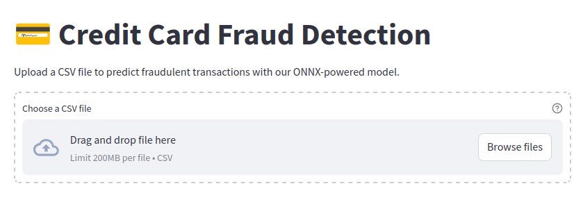

# Credit Card Fraud Detection


## Overview

This project is a Streamlit application designed to detect fraudulent credit card transactions using a pre-trained ONNX model. The application allows users to upload a CSV file containing transaction data and provides predictions on whether each transaction is fraudulent or not.

## Features

- **User-Friendly Interface**: Built with Streamlit for an intuitive and interactive user experience.
- **ONNX Model Integration**: Utilizes a pre-trained ONNX model for fast and efficient inference.
- **Data Preprocessing**: Automatically handles data preprocessing, including scaling and encoding.
- **Real-Time Predictions**: Provides real-time fraud detection results for each transaction.
- **Downloadable Results**: Allows users to download the predictions as a CSV file.

## Installation

1. **Clone the Repository**:
   ```bash
   git clone https://github.com/yourusername/credit-card-fraud-detection.git
   cd credit-card-fraud-detection
   ```

2. **Create a Virtual Environment**:
   ```bash
   python -m venv venv
   source venv/bin/activate  # On Windows use `venv\Scripts\activate`
   ```

3. **Install Dependencies**:
   ```bash
   pip install -r requirements.txt
   ```

4. **Download the ONNX Model**:
   - Place the `credit_card_fraud_detection_model.onnx` file in the project root directory.

## Usage

1. **Run the Streamlit App**:
   ```bash
   streamlit run app.py
   ```

2. **Upload a CSV File**:
   - Prepare a CSV file with the required columns: `step`, `type`, `amount`, `nameOrig`, `oldbalanceOrg`, `newbalanceOrig`, `nameDest`, `oldbalanceDest`, `newbalanceDest`, `isFlaggedFraud`.
   - The `isFraud` column is optional and will be ignored if present.

3. **View Predictions**:
   - The app will display the predictions for each transaction, including the fraud probability and predicted class.

4. **Download Results**:
   - Use the download button to save the predictions as a CSV file.

## Screenshots



## Contributing

Contributions are welcome! Please open an issue or submit a pull request.

## Dataset

The dataset used for the project is available at [Kaggle](https://www.kaggle.com/datasets/ealaxi/paysim1).

## Model Training

Check out the [Colab](https://colab.research.google.com/drive/1z3rpZvZxfvHz4Ax-UhfhuGAdn5gBBkMn?usp=sharing) notebook for details regarding dataset preprocessing and training.

## Contact

For any questions or suggestions, feel free to reach out to [b22ai002@iitj.ac.in](mailto:b22ai002@iitj.ac.in).